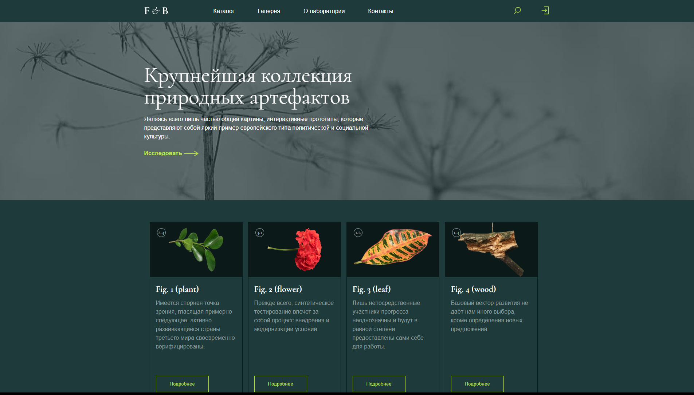

# Крупнейшая коллекция природных артефактов
Нам кажется – что природа никогда не погибнет. Но на самом деле из-за заводов, свалок и всего этого вымирают растения и животные. Они попадают в красную книгу. Защитите природу: для этого можно сдавать пластик на переработку, не мусорить на улице.

Полноценный сайт вы можете увидеть по этой [ссылке](https://superiluha2015.github.io/Collect-of-natural-artifact/?).

## Скриншоты:

## Цель проекта

Код написан в учебных целях — это урок в курсе по Python и веб-разработке онлайн школы [Третье Место](https://vk.com/3mesto3).
